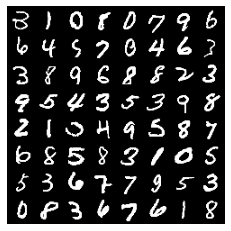

# 3D Graphics Systems Course - IMPA 2021

#### Leonardo Quatrin Campagnolo

---------

## Assignment 1 - Python / Collab and MNIST

In this first assignment, the objective was to get more familiar with pytorch and google colab environment. So, i spent some time reading the documentation to be able to understand how to handle tensors with Pytorch and how to create a simple neural network to perform digit recognition.

### PyTorch Tensors

The first part of the work consisted of creating and manipulating tensors using the PyTorch. I was able to observe some differences using the different ways to create Tensors:

Both **torch.Tensor** and **torch.empty** use the default type that can be checked by calling the function **torch.get_default_dtype()**. We can also change the current default type by using:


```python
torch.set_default_dtype(torch.float)
torch.get_default_dtype()
> torch.float32
``` 

However, the type inferred by **torch.empty** can also be modified through a parameter. In the case of **torch.tensor**, the type ends up being inferred according to the input data.

Both the **torch.tensor** and **torch.Tensor** functions end up creating a copy of the data. Unlike the other methods, **torch.as_tensor** does not store a copy of the value that was passed. In this case, if a value is modified both from the tensor and from the input data, the change will be made in the same memory space.

### Tensor operations

We then made a simple experiment performing a multiplication operation on each row of a matrix. The simplest way to do this would be to implementing a for, multiplying each row by a number. However, in cases where we have larger tensors, this turns out to be very costly.
Thus, a test was performed using the **torch.mul** function and * operator. When comparing each implementation, we see how the performance improved, using a tensor of size 1000x600:

```python
# 6.054009437561035 s
def multLines(ts):
  for l in range(ts.shape[0]):
    for r in range(ts.shape[1]):
      ts[l,r] = ts[l,r] * (l+1) 
  return ts

# 0.0017743110656738281 s
def multLinesTensor(ts):
  ta = torch.arange(1, ts.size()[0]+1).view(-1, 1)
  return torch.mul(ta, ts)

# 0.0011224746704101562 s
def multLinesTensor2(ts):
  ta = torch.arange(1, ts.size()[0]+1).view(-1, 1)
  return ta * ts
``` 

### Neural network for digit recognition

The last part of this assignment consisted on making some tests on a simple 2-layer neural network for digit recognition using the MNIST dataset. Each image is 28x28 pixels with 1 color channel, defining grayscale images. We can use the **torchvision.utils.make_grid** function to see each batch in a more compact view.

```python
def show_batch(batch):
    im = torchvision.utils.make_grid(batch, nrow=8)
    plt.imshow(np.transpose(im.numpy(), (1, 2, 0)))
    plt.axis('off')
show_batch(images)
``` 



Through the **torch.bincount** function, it is also possible to check how balanced a batch is:

```python
print("Batch bincount:", torch.bincount(labels))
print("Train dataset bincount:", mnist_train_data.targets.bincount())
print("Test dataset bincount:", mnist_test_data.targets.bincount())
> Batch bincount: tensor([3, 5, 3, 2, 2, 2, 4, 5, 1, 5])
> Train dataset bincount: tensor([5923, 6742, 5958, 6131, 5842, 5421, 5918, 6265, 5851, 5949])
> Test dataset bincount: tensor([980, 1135, 1032, 1010,  982,  892,  958, 1028,  974, 1009])
``` 


