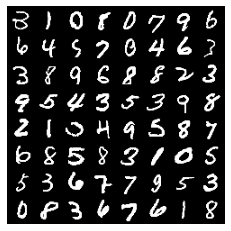
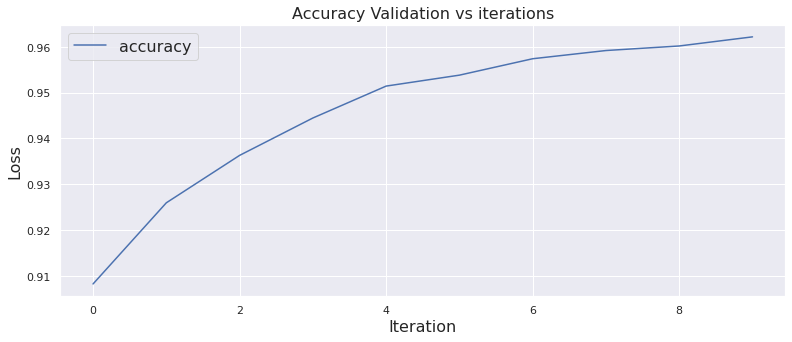
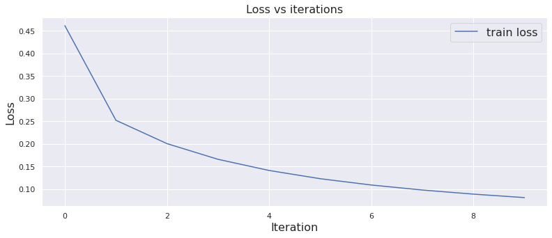
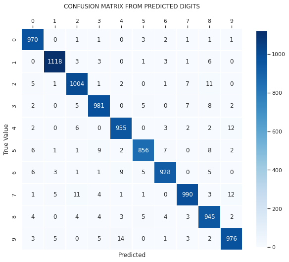

# 3D Graphics Systems Course - IMPA 2021

#### Leonardo Quatrin Campagnolo

---------

## Assignment 1 - Python / Collab and MNIST

In this first assignment, the objective was to get more familiar with pytorch and google colab environment. So, i spent some time reading the documentation to be able to understand how to handle tensors with Pytorch and how to create a simple neural network to perform digit recognition. The code of this assignment can be found [here](https://github.com/lquatrin/i3d21/blob/main/code/a1/Assignment_1.ipynb).

### PyTorch Tensors

The first part of the work consisted of creating and manipulating tensors using the PyTorch. I was able to observe some differences using the different options to create Tensors. Both **torch.Tensor** and **torch.empty** use the default type, which can be checked using the method **torch.get_default_dtype()**. The default type can also be changed by using **torch.set_default_dtype()**:

```python
torch.set_default_dtype(torch.float)
torch.get_default_dtype()
> torch.float32
``` 

The type inferred by **torch.empty** can also be modified through a parameter, and **torch.tensor** data type ends up being inferred according to the input data. Both **torch.tensor** and **torch.Tensor** functions end up creating a copy of the data. Unlike the other methods, **torch.as_tensor** does not store a copy of the value that was passed, but uses the same memory space. In this case, the value can be modified from both the tensor or the input structure.

### Tensor operations

A next experiment consisted on using the functions from PyTorch to optimize arithmetic operations. Here, the idea is to multiply each row of a matrix by a number. PyTorch supports broadcasting for element-wise operations, so it can be used to greatly improve the efficiency of the code. The simplest way to do this matrix multiplication would be implementing a for, multiplying each value of each row by number. However, for larger tensors, this turns out to be very costly.

Here, i made a test with a tensor of size 1000x600. When using the **torch.mul** function and * operator, i was able to drastically improve the performance:

```python
# 6.054009437561035 s
def multLines(ts):
  for l in range(ts.shape[0]):
    for r in range(ts.shape[1]):
      ts[l,r] = ts[l,r] * (l+1) 
  return ts

# 0.0017743110656738281 s
def multLinesTensor(ts):
  ta = torch.arange(1, ts.size()[0]+1).view(-1, 1)
  return torch.mul(ta, ts)

# 0.0011224746704101562 s
def multLinesTensor2(ts):
  ta = torch.arange(1, ts.size()[0]+1).view(-1, 1)
  return ta * ts
``` 

### Neural network for digit recognition

The last part of this assignment consisted on making some tests with a simple 2-layer neural network for digit recognition using the MNIST dataset, composed by grayscale images of size 28x28:

<p align="center">
  
  <br>
  <em>Fig. 1: Batch of 32 digits.</em>
</p>

Using the **torch.bincount** method, it is possible to see if a batch is balanced:

```python
print("Batch bincount:", torch.bincount(labels))
print("Train dataset bincount:", mnist_train_data.targets.bincount())
print("Test dataset bincount:", mnist_test_data.targets.bincount())
> Batch bincount: tensor([3, 5, 3, 2, 2, 2, 4, 5, 1, 5])
> Train dataset bincount: tensor([5923, 6742, 5958, 6131, 5842, 5421, 5918, 6265, 5851, 5949])
> Test dataset bincount: tensor([980, 1135, 1032, 1010,  982,  892,  958, 1028,  974, 1009])
``` 

Now, to perform the digit recognition using the MNIST dataset, i created a 2-layer network using the **nn.Sequential** class. In order to pass each set of images to the network, it is necessary to transform the image into a vector. In addition, the stochastic gradient gradient optimizer was used in this model:

```python
mnist_model = nn.Sequential(
    nn.Linear(dim_in, dim_hidden),
    nn.ReLU(),
    nn.Linear(dim_hidden, dim_out)
).to(device_gpu)

loss_function = nn.CrossEntropyLoss()
optimizer = torch.optim.SGD(mnist_model.parameters(), lr = 0.01)
``` 

With the main optimization loop being implemented as follows:

```python
for epoch in loop:
  loss_train = 0
  for batch_images, batch_labels in data_loader_train:
    batch_images = batch_images.to(device_gpu)
    batch_labels = batch_labels.to(device_gpu)

    batch_size = batch_images.shape[0]
    outputs = mnist_model(batch_images.view(batch_size, -1)) 
    loss = loss_function(outputs, batch_labels)
    loss_train += loss.item()

    optimizer.zero_grad()
    loss.backward()
    optimizer.step()
```

I generate the results using an intermediate layer with 128 nodes, trained with batches of 32 images, and using a learning rate of 0.01. In the graphs below, we can see that the accuracy is increasing (estimated in a validation loop), and the loss function is decreasing during the training step. After the optimization loop, an accuracy of 97.07% was achieved with the test data. Below are the graphs with the values of accuracy and loss function throughout the training. The loss validation was not evaluated in this report.

<p align="center">
  
  <br>
  <em>Fig. 2: Accuracy evaluated per iteration.</em>
</p>


<p align="center">
  
  <br>
  <em>Fig. 3: Graph of loss per iteration.</em>
</p>

I also plotted the confusion matrix to check the performance of the model for each category. As we can see, the majority of cases were correctly classified using the simple neural network implemented in this assignment.

<p align="center">
  
  <br>
  <em>Fig. 4: Confusion matrix considering the predicted results using the result model.</em>
</p>

#### Additional considerations

When using a low learning rate, it was necessary more iterations to converge, which was also noticed when increasing the number of nodes in the intermediate layer.

The batch size also affects the performance of the training. For smaller batches, the loss function decreased faster, obtaining greater accuracy: 97.71 for 8 images per batch, 97.64 for 16, and 96.95 to 32. However, it took a longer time per iteration: 11.68s, 8.99s and 7.16s respectively.

When passing the model to GPU, i realized that each iteration of the training ended up taking more time compared to CPU (7.16 to 9.68 seconds), using an intermediate layer of 128 nodes. Then, i did a test extrapolating the number of nodes in the intermediate layer to 10000. In this case, training the model in CPU took about 50s per iteration, while in GPU remained at 9s. In this case, a simple network does not end up having such a performance impact, as it cannot exploit GPU parallelization effectively. In addition, passing the model to the GPU can generate additional time due to memory allocation and transfer issues.
