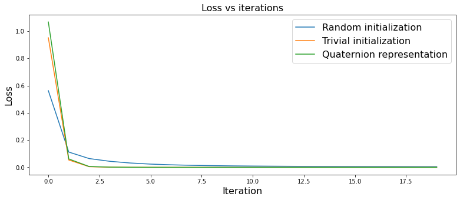

# 3D Graphics Systems Course - IMPA 2021

#### Leonardo Quatrin Campagnolo

---------

## Assignment 3 - Camera - Bundle Adjustment

In this assignment, the objective was to estimate the extrinsic parameters of a set (bundle) of cameras, given multiple pairs of relative transformations between them. The PyTorch3D API was used to represent and optimize the transformation matrix of each camera. The code of this assignment can be found [here](https://github.com/lquatrin/i3d21/blob/main/code/a3/Assignment3.ipynb).

### Setup

Given an optical system of N cameras, we want to find the extrinsic parameters of each camera. To optimize these parameters, the relative positions between each pair of cameras are computed, computing the relative matrix which maps one camera to another. The intrinsic parameters of the cameras are implicitly known, so only the extrinsic parameters are considered. Considering the epipolar geometry, we compute the essential matrix, estimating an affine transformation from one camera to another. 

The optimization procedure starts by randomly initializing the estimated cameras, plotted in orange:

Then, for each loop, the optimization triest to align the orange cameras with the ground truth, defined in purple, minimizing the distance between pairs of relative cameras:

To be able to find a valid solution to this problem, the first camera must be set as an anchor of the set of cameras, defining a reference coordinate system. Thus, the solution to the problem will consist on finding the relative transformations between each pair of cameras. With that in mind, the first camera is considered the trivial case, where its rotation matrix is the identity, and the translation is a zero vector. We can also visualize this as a normalization process, which can be done for any set of cameras given to the optimization procedure.

### Representing rotations

One of the problems of this assignment was how to represent each rotation matrix. The initial solution to this problem uses the log axis-angle representation. Using PyTorch3D API, it is possible to recover the 3x3 rotation matrix from the axis-angle using the method **so3_exponential_map**. In fact, there are a few possible solution to represent rotations:

#### 1. Fixed/Euler angles:

In this representation, the rotations are composed as a sequence of rotations, using the axes of a coordinate system (global or local). In this case, the final rotation is computed by accumulating all rotations around each axis (Rx, Ry, Rz). They are not commutative, i.e., the order matters. So, if we use different sequences, it will generate different final rotations. 

There are a few problems when using this representation: it has a singularity problem, which cause the loss of one degree of freedom in three-dimensions, known as "gimbal lock". It is also difficult to provide a smooth interpolation between two distinct points. Also, a slightly change in the parameters does not represent the same rotation of the rigid body. We can take the rotation around the pole of a sphere as an example: even rotating the point around the sphere, the distance does not correspond at the same amount if we rotate the same point at the equator of the sphere.

#### 2. Axis angle:

This is the standard reprensetation used in this assignment. In this case, the rotation is calculated based on an arbitrary axis, which is defined by the composition of 3 angles. According to the PyTorch3D documentation, the arbitrary axis is calculated using the Rodriguez Formula (from **so3_exponential_map**).

This representation does not generate the singularity problem, but we must convert back to a matrix to be able to composite a rotation. In addition, there is an ambiguity if we have the same axis with exchanged sign, since they can represent the same rotation. Still, they present the same limitation from the euler angles: it is difficult to provide a smooth interpolation between two points, and the small change of the parameters does not represent the same amount in a rigid body.

#### 3. Quaternion:

Considered a most robust way to represent rotations, which also provides a smooth interpolation and consistent rotation between the parameters. However, it requires a 4D vector to represent each rotation. Similar to Euler angles, the order of each rotation matters. Also, there is a particular property of quaternions that, if we want to generate a set of random unit quaternions, it will be more uniform at a sphere.

#### 4. Other representations:

A recent paper used SVD to predict rotations. In this case, 9 values are used to represent rotations [1]. In this report, i didn't try SVD representation for the bundle adjustment problem.

### Optimization Results

The SGD optimizer was used to estimate the extrinsic parameters of each camera. For each loop step, the relative matrix between each pair of cameras is evaluated and compared with a ground truth, which defines the loss function **camera_distance**. Each relative matrix is computed by getting the view matrix (or extrinsic camera matrix) of one camera, and multiplying by the inverse of a second view matrix, from other camera. Then, the rotation and translation of these relative matrices are used to compare with a known ground truth, also computing the loss function.

The first camera is initialized with the trivial case, and the others are initialized with random values. Since the axis-angle represetation is being used in this first experiment, both rotation and translation of the first camera are initialized with the a zero vector.

For the first result, using 2000 iterations, we reached a result with a camera_distance = 4.597e-03 at the last iteration:

with the cameras in purple being our ground truth, and the orange cameras being the approximated ones. The graph of loss vs iterations shows how the distance between the cameras are decreasing during the optimization loop. We can see that in the first steps, the accumulated loss is higher, since the cameras are initialized with random values:

Using the Cow Mesh, it is possible to generate a qualitative comparison between the optimized cameras with the ground truth. First we have the images generated using the initial state of the cameras:

Now comparing the Ground truth, with the optimzed cameras:

We can note that the first camera does not change during the optimization process, since it is the trivial case. There is some small differences between the ground truth and the optimized cameras. Take the image from the second row and third column as an example: we can note how it generated a slightly different image.

### Additional Results

To improve the approximation, i tried to not randomly initialize the rotation and translation of the cameras, but making all start as the trivial case. It seemed to be a better initial guess instead of just using random values. In this case, running the same optimization loop, i was able to achieve a result of camera_distance = 7.092e-08 at the last iteration:

We can see by the images generated after this optmization are closer to the ground truth. Here, we have first the results generated with the ground truth, then using the trivial initialization:

Lastly, i made an additional experiment representing each rotation as a quaternion. It also seemed to be a good representation since its interpolation works better than using axis-angle representation for rotations. However, the quaternions were transformed back to a matrix (using the method **quaternion_to_matrix**) to compute the relative cameras and the loss function. I also apply the trivial initialization for all cameras, but in this case, each rotation is initialized with the identity quaternion, which means no rotation. I was able to reach a camera_distance = 4.957e-08 as the final loss:

We can see the gerenated images using the quaternion representation are also similar to the ground truth, since we achieved a good result. As shown before, we first have the results generated with the ground truth, and then using the quaternion representation:

In this case, i also think some modifications could be done in the optimization loop to compare and compute the relative transformations with quaternions properly, but I ended up not progressing in this experiment. Finally, we compute the loss function for each experiment:

### References

[1] Levinson, J., Esteves, C., Chen, K., Snavely, N., Kanazawa, A., Rostamizadeh, A., & Makadia, A. (2020). An Analysis of SVD for Deep Rotation Estimation. ArXiv, abs/2006.14616.

