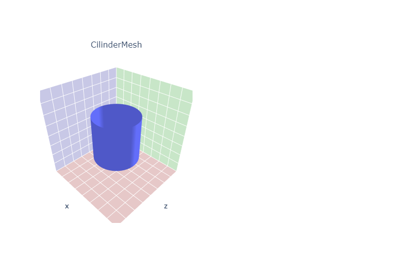

# 3D Graphics Systems Course - IMPA 2021

#### Leonardo Quatrin Campagnolo

---------

## Assignment 5 - ShapeNet Data and Plotly visualization

In this assignment, the idea was to manipulate and visualize some mdoels of the ShapeNet dataset, also trying to explore other different ways to visualize 3D models with plotly and PyTorch3D. We also made a further exploration on the generation of models using parametric functions with surfaces of revolution. The code of this assignment can be found [here](https://github.com/lquatrin/i3d21/blob/main/code/a5/Assignment5.ipynb).

The paper ShapeNet: An Information-Rich 3D Model Repository [1] shows how they produce a dataset with CAD models. In fact, most of the advances with machine learning were only possible thanks to the availability of huge amounts of data, enabling networks to learn distributions with high data diversification. In addition, having standardized information in databases is important for the whole community to have access to the same data, also facilitating comparisons and evaluations in general. Finally, the fact that we have databases increasingly richer in different aspects also makes it possible to generate solutions for different problems, enabling advances and applications for different areas, and also raising new challenges and ideas to be solved.

One of the challenges on producing a dataset is how to develop a structure that can organize data in a coherent way, especially if the database will be updated and expanded from time to time. It is also important to provide a diversified amount of data. In this case, the authors themselves made reservations about the data that were categorized, which have a bias due to the fact that they used CAD models. In this case, the database has a smaller number of natural objects due to the used format.

It is possible to note several challenges encountered when determining a vast database such as ShapeNet. According to the authors, the main challenge for creating a database like ShapeNet is to be able to define a good methodology to acquire and validate the notes written for each object, since it is expensive to use only manual intervetion for each model. One of the ways used by the authors was to apply algorithms to generate initial predictions, and then verify these predictions through crowd-sourcing pipelines and inspection by human experts, what they called as a hybrid strategy. It is a fact that using only manual intervention is more costly than using algorithms to make predictions, and both algorithms and humans can also be subject to errors. For that, the authors also added the annotation source, being a way of considering how reliable the information is, so each person can use it in the way he see most convenient.

### Data visualization with Plotly

In this assignment, it was used a subset of ShapeNet containing 329 models. The ShapeNet dataloader has its own render function to visualize the models, but in this assignment, the idead was to focus on visualizations with Plotly. Here we have an example showing some of the models using the ShapeNet's renderer:


Now using plotly, i first started by rendering the mesh using the method **plot_scene**:


Plotly has an advantage of providing an interactive rendering, but does not show the textures when using UV mapping. However, it is possible to define a color for each vertex. Here, i made an adjustment to the mesh setting a **TexturesVertex** object using randomized values:


Then, i tried to show two models in a same plot. Since they are centered at the origin, they will overlap. Using the method **plot_scene**, we can create two subplots to  visualize each mesh:


In a last experiment, i created a batch of meshes, by adding them as a list of tensors. In this case, i used 10 models starting at 250:

```python
model_verts_l = [shapenet_dataset[i+250]['verts'].to(device) for i in range(10)]
model_faces_l = [shapenet_dataset[i+250]['faces'].to(device) for i in range(10)]
model_textures_l_data = [torch.rand_like(model_verts_l[i]*0.5 + 0.4).to(device) for i in range(10)]
model_textures_l = TexturesVertex(verts_features=model_textures_l_data)

model_meshes_l_10 = Meshes(verts=model_verts_l, faces=model_faces_l, textures=model_textures_l)
```

In this case, i use the method **plot_batch_individually** with 5 columns per line to visualize the current batch of meshes:


### Creating new meshes using parametric models

In the last part of this assignment, i experimented the generation of new meshes using parametric functions, by applying a surface of revolution. For each mesh, a curve is rotated around the Y-axis, with each vertex being defined by:


where **r** is the curve along the interval [0,1] and **u**,**v** defines the vertices of our mesh. The UV coordinates were estimated to map an image on the surface of the mesh. Two approaches were implemented: first, we directly map the UV values into the UV coordinates. In the second approach, we compute the curve distance by summing the arc length function along the **v** coordinate:


with dy/dx being evaluated using finite differences. To compute the accumulated distance from 0 to a certain v, we accumulate steps of 0.01 to approximate the arc length. For the following results, the first image uses the arc length, and the second image uses uniform distribution.

#### Cilinder

The first experiment was creating a cilinder mesh. In this case, the function consists on a constant value:



Using the method **texturesuv_image_matplotlib**, it possible to check the UV coordinate defined for each vertex, using both strategies. First, we have the mapping using the arc length. The second image shows an uniform distribution:  


Since the function used to build a cilinder is a constant value, both strategies generates the same result. Then, since we're using UV mapping, a **MeshRenderer** is required to visualize the current mesh with texture data: 


#### Arc

The second function is an arc formed by the function:


Unlike the cilinder, we can note the UV coordinates defined for each vertex being different from each approach:


In this case, it generates different results:


#### Vase

The last results consisted on using the bezier library to generate a curve similar to a vase. Since i'm using the colab environment, an older version was installed since it conflicts with the numpy version used with pytorch3d ("2020.1.14" version). The first curve uses the following 5 control points: 

```python
[0.0, 0.25,  0.5, 0.75, 1.0]
[0.1, 2.0 ,  0.2, 0.0 , 0.3]
```


Visualizing the texture map, we can note how the curve length differs when reaching v = 0:


Using the **MeshRenderer**, the following results were generated using two different viewpoints:


### Point cloud to visualize meshes with TextureUV

It is not possible to visualize the mesh with plotly when using TexturesUV. However, there is an alternative by generating a point cloud, using the method **sample_points_from_meshes**. Here, i made some additional visualization with the generated meshes using point clouds:

<p align="center">


  

</p>
  
### References

[1] Chang, A.X., Funkhouser, T., Guibas, L., Hanrahan, P., Huang, Q., Li, Z., Savarese, S., Savva, M., Song, S., Su, H., Xiao, J., Yi, L., & Yu, F. (2015). ShapeNet: An Information-Rich 3D Model Repository. ArXiv, abs/1512.03012. (URL: https://arxiv.org/abs/1512.03012).
