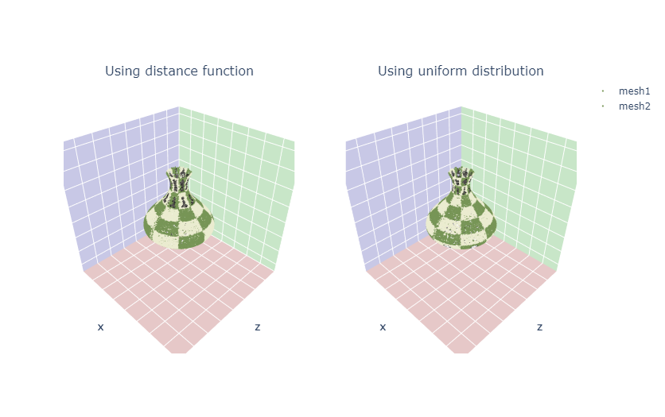
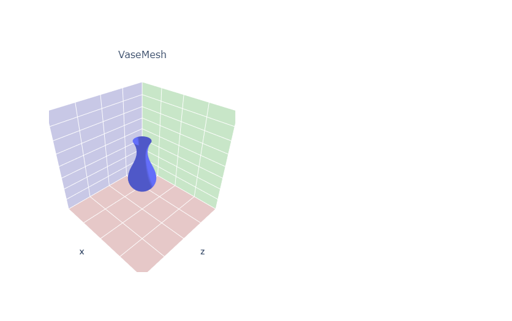
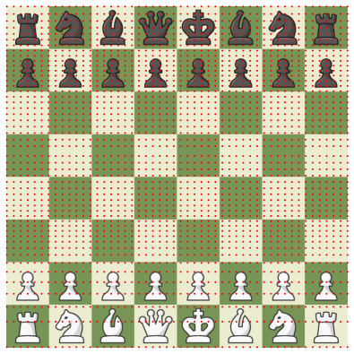
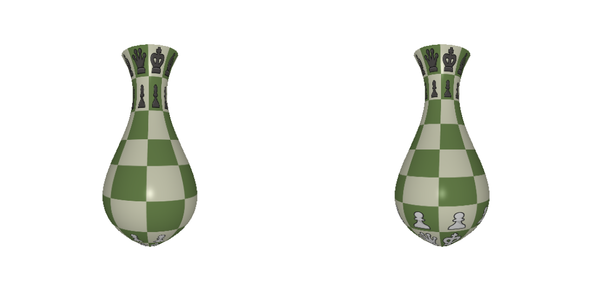
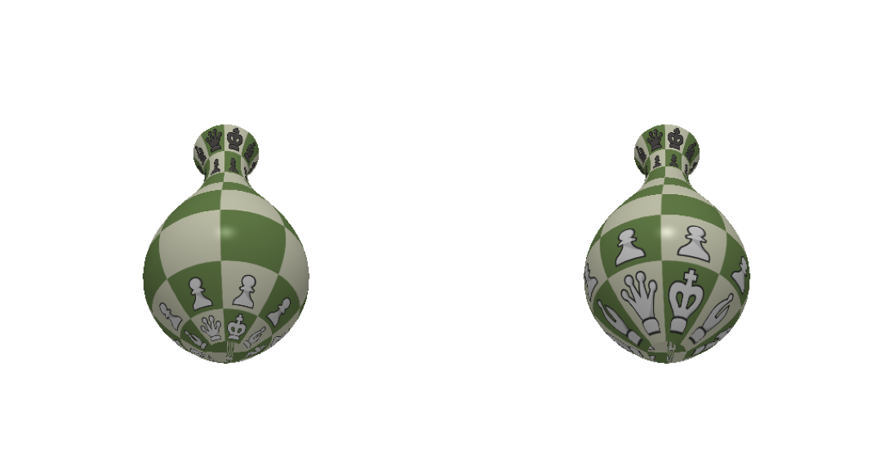
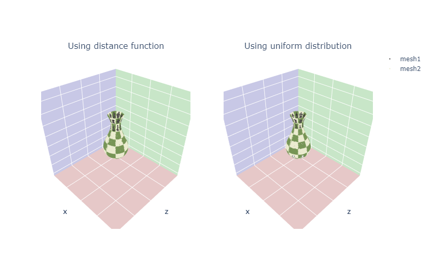

# 3D Graphics Systems Course - IMPA 2021

#### Leonardo Quatrin Campagnolo

---------

## Assignment 5 - ShapeNet Data and Plotly visualization TODO

In this assignment, the idea was to manipulate and visualize some mdoels of the ShapeNet dataset, also trying to explore other different ways to visualize 3D models with plotly and PyTorch3D. We also made a further exploration on the generation of models using parametric functions with surfaces of revolution.

The paper ShapeNet: An Information-Rich 3D Model Repository [1] shows how they produce a dataset with CAD models. In fact, most of the advances with machine learning were only possible thanks to the availability of huge amounts of data, enabling networks to learn distributions with high data diversification. In addition, having standardized information in databases is important for the whole community to have access to the same data, also facilitating comparisons and evaluations in general. Finally, the fact that we have databases increasingly richer in different aspects also makes it possible to generate solutions for different problems, enabling advances and applications for different areas, and also raising new challenges and ideas to be solved.

One of the challenges on producing a dataset is how to develop a structure that can organize data in a coherent way, especially if the database will be updated and expanded from time to time. It is also important to provide a diversified amount of data. In this case, the authors themselves made reservations about the data that were categorized, which have a bias due to the fact that they used CAD models. In this case, the database has a smaller number of natural objects due to the used format.

It is possible to note several challenges encountered when determining a vast database such as ShapeNet. According to the authors, the main challenge for creating a database like ShapeNet is to be able to define a good methodology to acquire and validate the notes written for each object, since it is expensive to use only manual intervetion for each model. One of the ways used by the authors was to apply algorithms to generate initial predictions, and then verify these predictions through crowd-sourcing pipelines and inspection by human experts, what they called as a hybrid strategy. It is a fact that using only manual intervention is more costly than using algorithms to make predictions, and both algorithms and humans can also be subject to errors. For that, the authors also added the annotation source, being a way of considering how reliable the information is, so each person can use it in the way he see most convenient.

### Data visualization with Plotly

In this assignment, it was used a subset of ShapeNet containing 329 models. The ShapeNet dataloader has its own render function to visualize the models, but in this assignment, we will focus on visualizations with Plotly. Here we have an example showing some of the models using the ShapeNet's renderer:


Now using plotly we can render and manipulate the viewpoint of a mesh:


It is not possible to show the texture with UV mapping. However, it is possible to define a color for each vertex. Here, we have the same model with random colors defined at each vertex:


To visualize more than one mesh, we can render them at different plots, otherwise they will overlap:


It is also possible to define a batch of meshes, by adding them as a list of tensors:

```python
model_verts_l = [shapenet_dataset[i+250]['verts'].to(device) for i in range(10)]
model_faces_l = [shapenet_dataset[i+250]['faces'].to(device) for i in range(10)]
model_textures_l_data = [torch.rand_like(model_verts_l[i]*0.5 + 0.4).to(device) for i in range(10)]
model_textures_l = TexturesVertex(verts_features=model_textures_l_data)

model_meshes_l_10 = Meshes(verts=model_verts_l, faces=model_faces_l, textures=model_textures_l)
```

Then, using the method **plot_batch_individually**, we're able to visualize the current batch of meshes:


### Creating new meshes using parametric models

In the last part of this assignment, i experiment the generation of new meshes using parametric functions, creating new meshes by applying a surface of revolution.

For each mesh, a curve is rotated around the Y-axis, with each vertex being defined at:


where **r** is the value of the curve along the interval and **u**,**v** defines the vertices of our mesh. The UV coordinates were estimated to map an image on the surface of the mesh. Two approaches were implemented: first, we directly map the UV values into the UV coordinates. The second approach, we compute the curve distance by summing the arc length function:


#### Cilinder


#### Arc


#### Vase (1)

I also experimented the bezier library to generate a curve similar to a vase. Since i'm using the colab environment, a older version was installed since it conflicts with the numpy version used with pytorch3 ("2020.1.14" version). 

     [0.0, 0.25,  0.5, 0.75, 1.0],
     [0.1, 2.0 ,  0.2, 0.0 , 0.3],





#### Vase (2)

     [0.0, 0.25,  0.5, 0.75, 1.0],
     [0.1, 1.0 ,  0.2, 0.0 , 0.3],













### References

[1] ShapeNet: An Information-Rich 3D Model Repository
