# 3D Graphics Systems Course - IMPA 2021

#### Leonardo Quatrin Campagnolo

---------

## Assignment 7 - Render Point Clouds and Meshes

In this assignment, the idea is to practice operations with 3D meshes and point clouds using the PyTorch3D. The code of this assignment can be found [here](https://github.com/lquatrin/i3d21/blob/main/code/a7/Assignment7.ipynb).

### Rendering a Mesh

First, i render the cow mesh with the **MeshRenderer**, using a perspective camera and a point light with the **SoftPhongShader**:

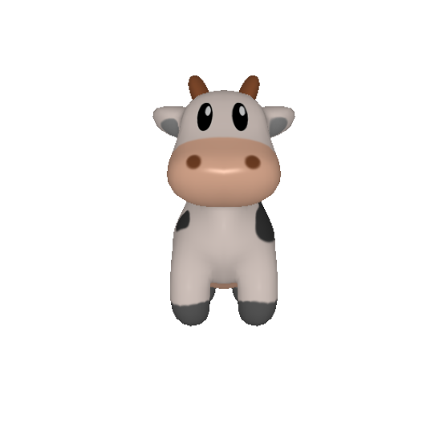

Then, i modified other parameters. In the first image, i modified the light source position from [0.0, 0.0, -3.0] to [0.0, 5.0, 0.0]. In the second image, i changed the specular color and shininess of the materials parameter defined in renderer.

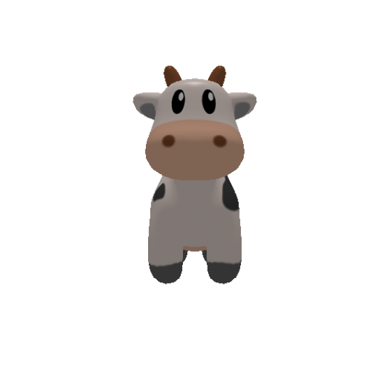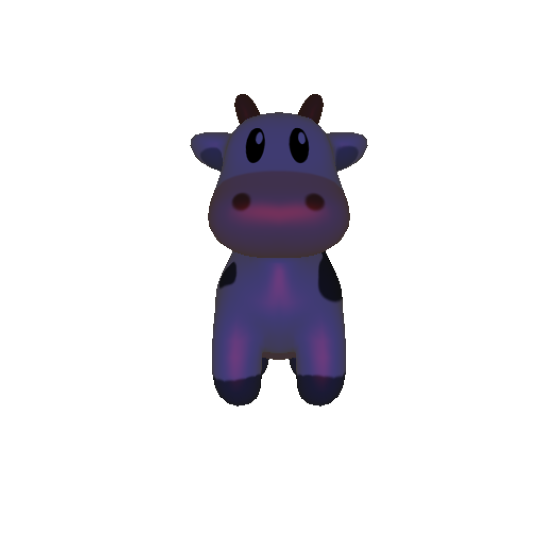

Here, i modified the shader being used by the renderer from **SoftPhongShader** to **HardFlatShader**, generating a different light effect:

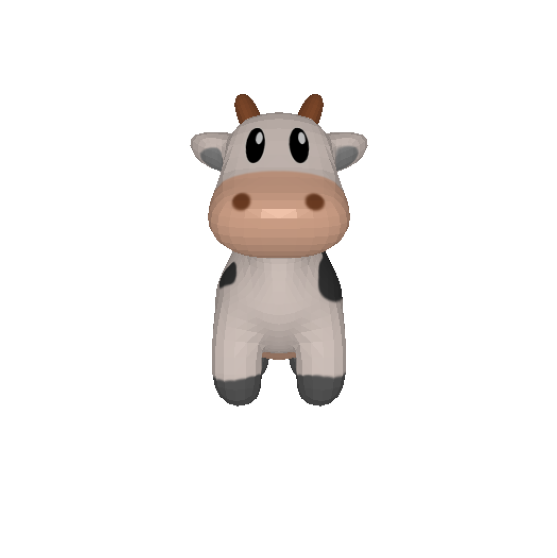

Some types of shader require some data to be presented in the **Meshes** object. According to the documentation [1], **SoftPhongShader** computes per pixel lighting, by interpolating the coordinates and normals for each pixel. For **HardFlatShader**, it computes per face lighting, using the average face position and normal. When trying to apply the **SoftGouraudShader**, the **textures** parameter of each mesh must be a **TexturesVertex**, because it calculates the color of each pixel by interpolating the vertex colors of each triangle using the barycentric coordinates. For the cow mesh, it is loaded with UV mapping, which set a **TexturesUV** object. In this case, i specify the current color value attached to each vertex as its estimated normal. The cow mesh already have a normal list attached to each vertex. However, i also tested to estimate them by averaging the normals of the faces that shares the same vertex:

```python
vert_list = mesh.verts_list()[0]
face_list = mesh.faces_list()[0]

# Calculate the normal of each face
number_of_faces = mesh.faces_list()[0].shape[0]
face_normals = np.zeros((number_of_faces, 3))
for i in range(number_of_faces):
  a = np.array(vert_list[face_list[i][0]])
  b = np.array(vert_list[face_list[i][1]])
  c = np.array(vert_list[face_list[i][2]])

  ba = b - a
  ba = ba / np.linalg.norm(ba)

  ca = c - a
  ca = ca / np.linalg.norm(ca)
  
  f_normal = np.cross(ba, ca)
  f_normal = f_normal / np.linalg.norm(f_normal)
  
  face_normals[i] = f_normal

# Accumulate the normals per each vertex
number_of_vertices = mesh.verts_list()[0].shape[0]
vert_n = np.zeros((number_of_vertices, 1), dtype=int)
vert_normals = np.zeros((number_of_vertices, 3))
for f in range(number_of_faces):
  for i in range(3):
    v = face_list[f][i]
    vert_normals[v] = vert_normals[v] + face_normals[f]
    vert_n[v] = vert_n[v] + 1

# Normalize them
for v in range(number_of_vertices):
  vert_normals[v] = vert_normals[v] / vert_n[v]
  vert_normals[v] = vert_normals[v] / np.linalg.norm(vert_normals[v])
```

Normalizing them with **(normals+1.0) * 0.5**, i got the following result:

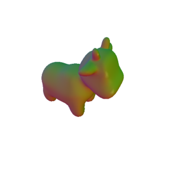

### Moving the scene

I first experimented changing the light and material parameters to update the current renderer. Now, we want to move the scene, changing the current camera or moving the current mesh. First, i changed the camera by modifying the parameters of the method **look_at_view_transform**, which receives 3 parameters: the camera distance, the elevation and the azimutal angle. Changing these parameters will generate different images of the current mesh:

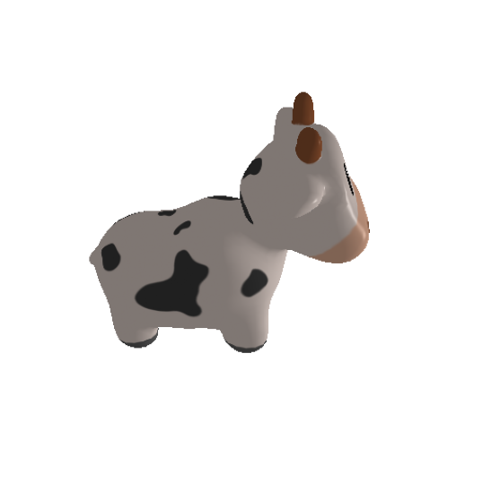

Then, i tried to rotate the mesh, by using the **Rotate** method [2], which creates a Transform3d that can be applied to a set of points. Here, i create a new mesh by passing a new list of vertices rotated around the Y-axis:

```python
from pytorch3d.transforms import axis_angle_to_matrix
import math
a_angle = torch.Tensor([0, math.pi, 0])
rotate_transform = Rotate(axis_angle_to_matrix(a_angle))

verts  = mesh.verts_list()[0].clone().detach()
verts = rotate_transform.transform_points(verts)

cow_mesh = Meshes(verts=[verts],
                  faces=mesh.faces_list(),
                  textures=mesh.textures)
```

Rotating the object will consequently change the lighting effect, since the light source stayed in the same position, which can be noted by the following image:

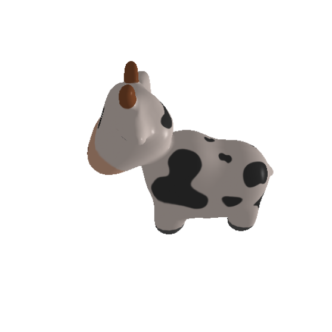

### Batched Rendering

Using the **look_at_view_transform** method [3], it is possible to create a batch of different cameras to visualize the mesh at different viewpoints, by passing a 1D tensor with different values:

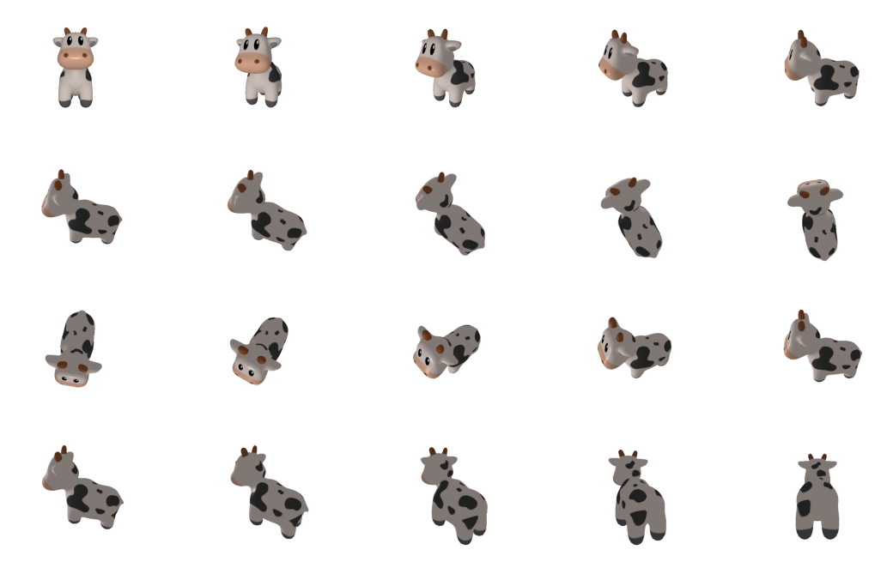

After running this example, i made a batch of 2 images to generate two meshes facing each other:

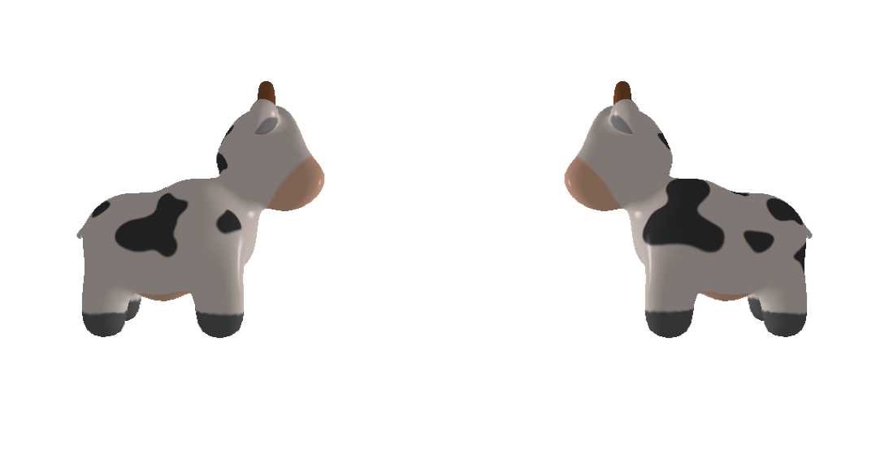

Then, to put two meshes in a same scene, i used the method **join_meshes_as_scene**, to create a single object of **Meshes** with two objects. To generate a similar result with two meshes facing each other, i used the object that i rotated before and offset both meshes so they not overlap. Then, i just rendered the scene again:

```python
offset1 = mesh.verts_padded().new_tensor([0, 0, -1]).expand(mesh.verts_packed().shape)
offset2 = mesh.verts_padded().new_tensor([0, 0, 1]).expand(mesh.verts_packed().shape)
double_mesh = join_meshes_as_scene([cow_mesh.clone().offset_verts_(offset1), mesh.clone().offset_verts_(offset2)])

R, T = look_at_view_transform(dist=4, elev=0.0, azim=90)
cameras = FoVPerspectiveCameras(device=device, R=R, T=T)

lights.location = torch.tensor([[0.0, 0.0, -3.0]], device=device)
images = renderer(double_mesh, cameras=cameras, lights=lights)
```

with the following image as result. We can note how the lighting effects are different at each mesh, since they are in the same scene.

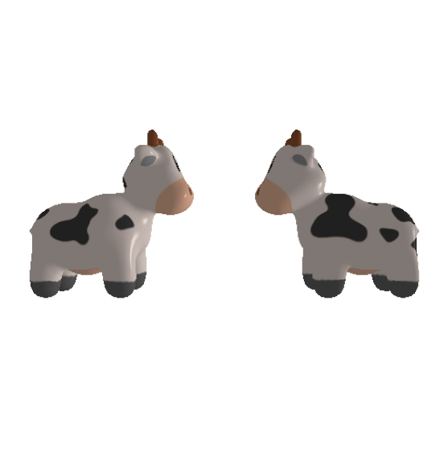

### Rendering Point Clouds

Pytorch3D also provide an option to render point clouds, by creating a **PointClouds** object. Each object receives a list of vertex positions and a list of features, such as the rgb color attached to each point. In this case, a **PointsRasterizer** is created with the cameras and rasterization settings to be passed to the **PointsRenderer**. Here i made some experiments rendering a point cloud, changing its background color.

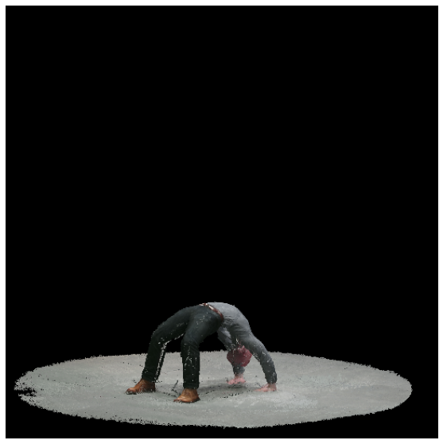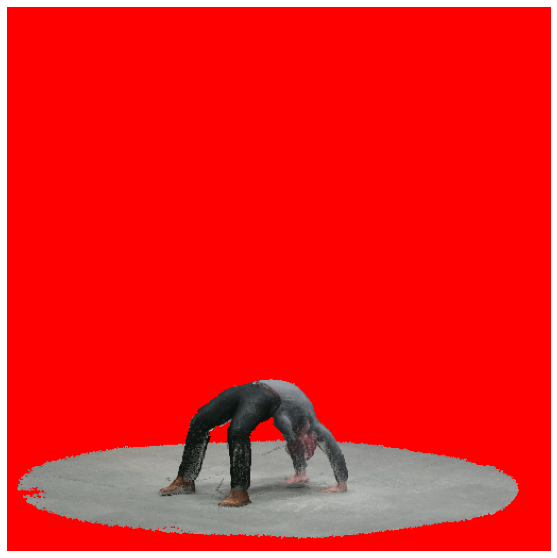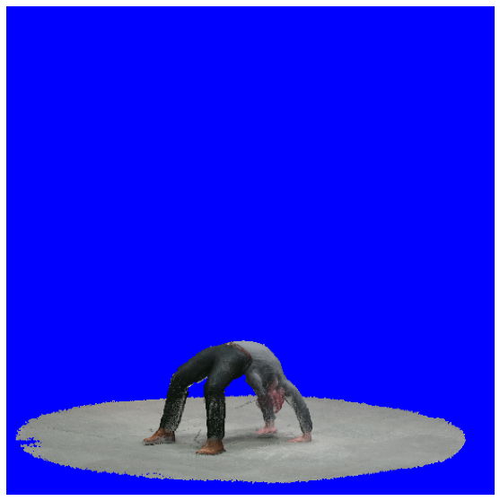

#### Pulsar Backend

The pulsar backend [4] is also available in PyTorch3D. In this case, the scene is represented by a set of spheres, each being defined by a position, a radius, an opacity and a feature vector, which can correspond to lighting properties or an abstract
feature representation for use in a neural network. The renderer has a parameter called "gamma", which controls the blending functions. a small value leads to hard blending, and a large value leads to soft blending. According to the authors, they allow values in the interval [1e-5, 1] to maintain numerical stability. Lastly, a "bg_col" parameter can also be used to define the background color. Here, we have a first image using Pulsar:

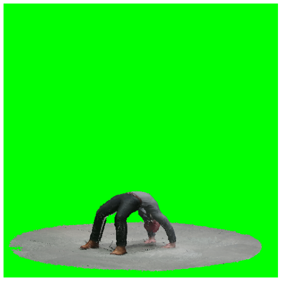

Then, i created a batch of pointclouds to visualize with Pulsar at different viewpoints, using the method **image_grid** to visualize them. In this case, it is requires to pass a list of point clouds and a list of gamma values. However, the renderer did not accept a list of background colors, so let set the same for all rendered images:

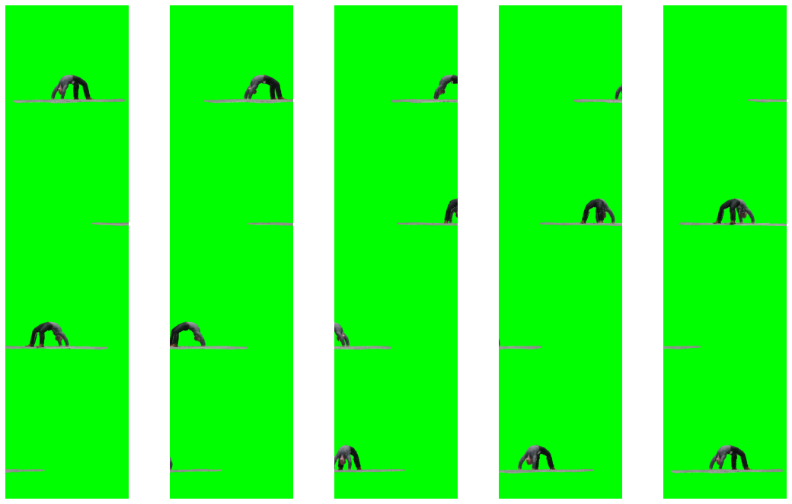

### Plotly visualization of Point Clouds

It is possible to render point clouds using the avaiable methods from **pytorch3d.vis.plotly_vis**. First, it is possible to render the point cloud using the function **plot_scene**:


It is also possible to pass a batch of points. In this case, i made a simple test by rendering a batch of 2 point clouds, offsetting the second one:


Finally, using the **plot_batch_individually** method, it is possible to render each point cloud in a subplot:

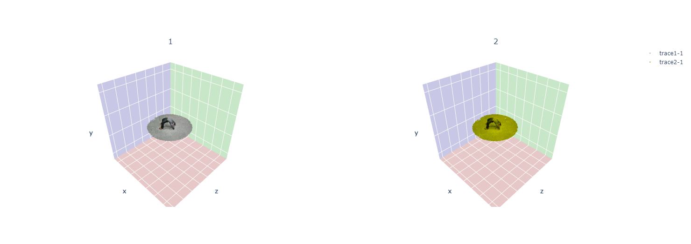

### References

[1] PyTorch3D Documentation: shader. URL: https://pytorch3d.readthedocs.io/en/latest/modules/renderer/shader.html.

[2] PyTorch3D Documentation: transforms. URL: https://pytorch3d.readthedocs.io/en/latest/modules/transforms.html.

[3] PyTorch3D Documentation: cameras. URL: https://pytorch3d.readthedocs.io/en/latest/modules/renderer/cameras.html.

[4] Lassner, C. and Zollhöfer, M., “Pulsar: Efficient Sphere-based Neural Rendering”, arXiv e-prints, 2020. URL: https://arxiv.org/pdf/2004.07484.pdf
