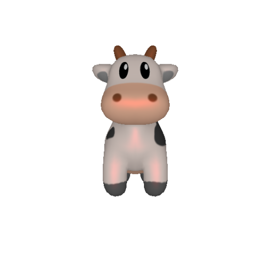

# 3D Graphics Systems Course - IMPA 2021

#### Leonardo Quatrin Campagnolo

---------

## Assignment 7 - Render Point Clouds and Meshes

In this assignment, the idea is to practice operations with 3D meshes and point clouds using the PyTorch3D.

### Loading a textured mesh and visualizing its texture map

In this report, the cow mesh was used for the experiments, which can be loaded from PyTorch3D repository. The function **load_objs_as_meshes** can be used to load all the data from the current object. It contains a UV coordinate defined for each vertex, and we can visualize the current UV mapping using the function **texturesuv_image_matplotlib** from pytorch3d.vis.texture_vis:


where the red dots defines the UV coordinate of each vertex.

### Rendering a Mesh

In PyTorch3D, a renderer is composed of a rasterizer and a shader which each have a number of subcomponents such as a camera (orthographic/perspective). First, the **MeshRenderer** will be used with a perspective camera and a point light, using the  **MeshRasterizer** and the **SoftPhongShader**:


It is possible to update the rendering parameters by passing it when generating a new batch of images, such as light source position or material.



Also changing the shader, it is possible to generate different effects. Here we have another result of the cow mesh using a new **MeshRenderer** with **HardFlatShader**:


Some types of shader require some data to be presented in the **Meshes** object. When using **SoftGouraudShader**, the **textures** parameter must be a **TexturesVertex** type, which differs from using the UV mapping (**TexturesUV** type). In this case, we specify the current color value attached to each vertex as its estimated normal. The cow mesh already have a normal list attached to each vertex. However, we can also estimate them by averaging the normals of the faces that shares the same vertex (having a considerable smooth surface mesh). Normalizing them with **(normals+1.0) * 0.5**, i got the following result:


### Moving the scene

As mentioned before, we can change the light source or material parameter to update the current renderer. It is also possible to change the current camera. For each new one, we use the **look_at_view_transform** method, which receives 3 parameters: the distance of the camera from the object, the elevation and the azimutal angle:

TODO: find a representative picture

Changing these parameters will generate different images of the current mesh:


It is also possible to move the current object. Here, we create a new mesh by passing a new list of vertices rotated around the Y-axis:

```python
from pytorch3d.transforms import axis_angle_to_matrix
import math
a_angle = torch.Tensor([0, math.pi, 0])
rotate_transform = Rotate(axis_angle_to_matrix(a_angle))

verts  = mesh.verts_list()[0].clone().detach()
verts = rotate_transform.transform_points(verts)

cow_mesh = Meshes(verts=[verts],
                  faces=mesh.faces_list(),
                  textures=mesh.textures)
```

Rotating the object will also change the lighting effect, since the light source stayed in the same position, which can be noted by the following image:


### Batched Rendering

Using the **look_at_view_transform** method, it is possible to create a batch of different cameras to visualize the mesh at different viewpoints:


Here we have two different views, each one rendering the current mesh in a different viewport:


If we want to create a single object of **Meshes** with two objects, we use the method **join_meshes_as_scene**, and render the scene again:

```python
offset1 = mesh.verts_padded().new_tensor([0, 0, -1]).expand(mesh.verts_packed().shape)
offset2 = mesh.verts_padded().new_tensor([0, 0, 1]).expand(mesh.verts_packed().shape)
double_mesh = join_meshes_as_scene([cow_mesh.clone().offset_verts_(offset1), mesh.clone().offset_verts_(offset2)])

R, T = look_at_view_transform(dist=4, elev=0.0, azim=90)
cameras = FoVPerspectiveCameras(device=device, R=R, T=T)

lights.location = torch.tensor([[0.0, 0.0, -3.0]], device=device)
images = renderer(double_mesh, cameras=cameras, lights=lights)
```

Using our previously rotated cow_mesh, we get the following result:


We can note how the lighting effects are different at each mesh.

### Rendering Point Clouds

[1]


FoVOrthographicCameras

### Plotly visualization of Point Clouds

It is possible to render point clouds using the avaiable methods from **pytorch3d.vis.plotly_vis**.

### References

[1] Pulsar: Efficient Sphere-based Neural Rendering (https://arxiv.org/pdf/2004.07484.pdf)
