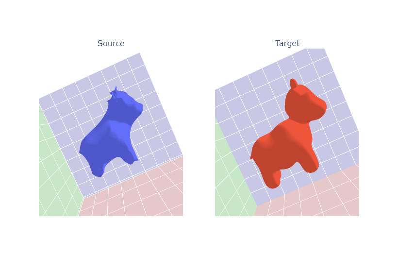
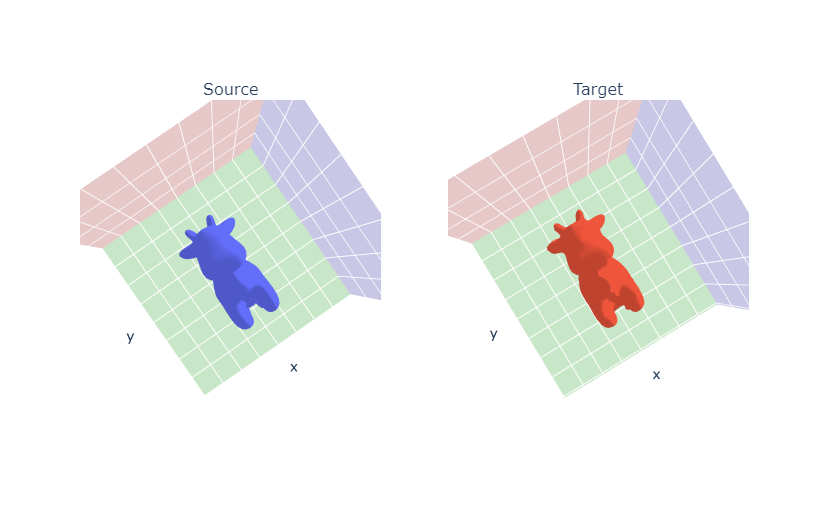

# 3D Graphics Systems Course - IMPA 2021

#### Leonardo Quatrin Campagnolo

---------

## Assignment 9 - View Optimization / Fit Mesh

In this assignment, the idea is to practice operations with differentiable rendering using the PyTorch3D to optimize meshes and scene parameters from multiple viewpoints. The code of this assignment can be found [here](https://github.com/lquatrin/i3d21_p/tree/main/code/a9/Assignment9.ipynb).

### Rendering pipeline and discontinuity issues

A rendering pipeline is used to generate 2d images from 3d scenes, where the scene is defined by 3d objects represented by vertices, lines and polygons. It projects the current scene onto the image plane defined by a camera in a 3D environment. To do that, the camera first transforms each 3D object from world to view coordinates, which can be seem as a change of basis, considering the camera positioned at (0,0,0) and directed along the z direction (being positive or negative depending on the convention). Then, a projection matrix (also given by the camera) projects the triangles onto the image plane, which is considered the xy-plane. A camera also defines which objects will be shown, and which objects will be discarded, when they do not influence the rendered image. In the last step, each pixel is colored by considering the nearest face. Texture mapping and lighting effects are also computed in this stage for each pixel.

According to [1], there are two steps that are not differentiable in rendering. First, the z discontinuity, which happens when two triangles are close in terms of depth, then a small change in its vertices may cause them to overlap. The overlap causes a discontinuity since it causes a step change in pixel color when the nearest face changes. There is also a second discontinuty problem caused by changing the position of a triangle in screen space. In this case, a step change in pixel color is caused due to face boundaries.

In PyTorch3D, they used a soft rasterizer [2] to solve these problems. The problem of z discontinuity is solved by soft aggregating the K nearest faces. The second discontinuity problem was solved by decaying each face’s influence toward its boundary. It is important to notice that PyTorch3D is implemented based on each face that intersects the camera's image plane, instead of considering each pixel, since the face blending have to be calculated.

### Dataset Creation

In this assignment, the cow mesh was used. So, first,  different camera positions are sampled, encoding multiple viewpoints of the cow:


Using the silhouette renderer, it shows the top k faces per pixel, based on the 2d euclidean distance of the center of the pixel to the mesh face:


Using these shader, it is possible to compare the edges of the mesh according to each viewpoint. In these cases, the lighting is not computed, according to the documentation [3]. Here, i made a simple test by changing the light source position and generate the images with silhouette renderer:


Both configurations generated the same images when using **SoftSilhouetteShader**.

### Mesh prediction via silhouette rendering

In this first experiment, a mesh will be predicted by observing target images without any knowledge of the ground truth. Here, cameras and lighting positions are assumed to be known. The optimized mesh is initialized as a sphere, and an offset will be learned for each vertex at each optimization step. Here, i have the first ground truth images generated using multiple viewpoints of the cow mesh with silhouette renderer, that will be used to fit the sphere to the target mesh:


The offsets were initialized on zero, and each iteration computes the loss from 2 randomly chosen views. The loss function evaluates the silhouette of the generated images with the target images. Besides that, edge loss (**mesh_edge_loss**), mesh normal consistency (**mesh_normal_consistency**), and mesh laplacian smoothing (**mesh_laplacian_smoothing**) were also added to the loss function. I start by using the following weights:

```python
losses = { "silhouette": { "weight": 1.0,  "values": []},
           "edge":       { "weight": 1.0,  "values": []},
           "normal":     { "weight": 0.01, "values": []},
           "laplacian":  { "weight": 1.0,  "values": []}, }
```

After 2000 iterations, i got the following result:


As we can see, the resultant mesh is smoother compared to the target, but it is also a similar result. Then, i changed the optimization step to use 1, 4 and 8 views per iteration:

1 view per iteration




4 views per iteration


8 views per iteration


With only 1 view per iteration, the result does not converge properly as using 2 views. However, from 4 to 8 views, i didn't get an effective change between the results.

**TODO: CHANGE THE DATASET TO HAVE ONLY ONE POINT OF VIEW INSTEAD OF MULTIPLE (20) VIEWS**

#### Using higher level icosphere 

For the first experiments, i use a sphere generated from **ico_sphere** [4] using level = 4. If we compare the number of vertices of each mesh, we can see the sphere with level = 4 has a similar number of vertices comparing with the cow mesh. In a last experiment, i tested if it is possible to generate better results using a sphere with level = 5:

```python
Cow Mesh Vertices: 2930
Sphere level 4 Mesh Vertices: 2562
Sphere level 5 Mesh Vertices: 10242
```

After the optimization loop, i saw the cow's neck was not well defined, as it is shown by the following images:



Then, i tried to change the current views used to optimize the mesh, trying to put more focus at the cow's neck:


After running the optimization procedure again, it is possible to check how this specific part of the mesh is closer to the target. In this way, we can see that good representative images are important to generate a good approximation of the mesh.


### Mesh and texture prediction via textured rendering

--Later, we will fit a mesh to the rendered RGB images, as well as to just images of just the cow silhouette. For the latter case, we will render a dataset of silhouette images. Most shaders in PyTorch3D will output an alpha channel along with the RGB image as a 4th channel in an RGBA image. The alpha channel encodes the probability that each pixel belongs to the foreground of the object. We contruct a soft silhouette shader to render this alpha channel.


We can predict both the mesh and its texture if we add an additional loss based on the comparing a predicted rendered RGB image to the target image. As before, we start with a sphere mesh. We learn both translational offsets and RGB texture colors for each vertex in the sphere mesh. Since our loss is based on rendered RGB pixel values instead of just the silhouette, we use a SoftPhongShader instead of a SoftSilhouetteShader.


We initialize settings, losses, and the optimizer that will be used to iteratively fit our mesh to the target RGB images:


We write an optimization loop to iteratively refine our predicted mesh and its vertex colors from the sphere mesh into a mesh that matches the target images:


4.1 Compare the target and source meshes and describe the result qualitatively.

4.2 Do you think it could be better? Analyze the losses values, the meshes, the hyperparemeters and try other values. Even if you don't get a better result, try to explain your intutition for the changes you made.

4.3 Make a copy of the target mesh and now try to optimize the texture only, starting from the ground truth geometry. Describe your result.

[EXTRA] E.1 Deform the textured cow into a sphere - you can choose to supervise with multi-view images (of a sphere) or the sphere geometry. Save the result, then deform the textured sphere into the cow again. What happened?


### Camera Position Optimization

Until now, we assumed we knew the cameras and we learned how to infer the geometry and texture of a mesh using a differentiable renderer and supervising the training with the multiview images dataset.

Now, we'll assume we have the geometry and images of the object, but we don't know the cameras. Can we infer the camera position by backpropagation?

Here we create a simple model class and initialize a parameter for the camera position.

Initialize the model and optimizer
Now we can create an instance of the model above and set up an optimizer for the camera position parameter.

Run the optimization
We run several iterations of the forward and backward pass and save outputs every 10 iterations. When this has finished take a look at ./cow_optimization_demo.gif for a cool gif of the optimization process!

5.1 Evaluate how close our prediction is to the ground truth camera position. Explain your metric.

5.2 Experiment with other views - different target images and different initial positions to the camera model. Does it always work?

EXTRA E.2: Could you estimate the scene illumination - in this case, the location of a single point light? Set up and run an example

### Light Position Optimization

The last experiment of this assignment was to optimize a light position given the camera 


### References

[1] Accelerating 3D Deep Learning with PyTorch3D

[2] Soft Rasterizer: Differentiable Rendering for Unsupervised Single-View Mesh Reconstruction

[3] https://pytorch3d.readthedocs.io/en/latest/modules/renderer/shader.html

[4] https://pytorch3d.readthedocs.io/en/latest/_modules/pytorch3d/utils/ico_sphere.html
