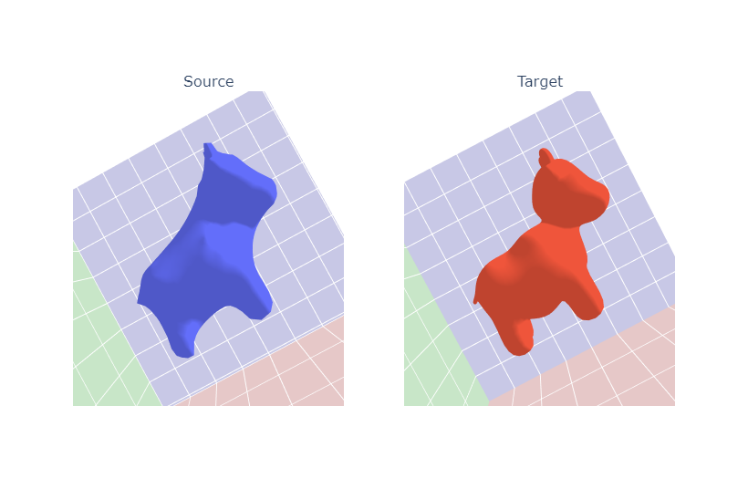
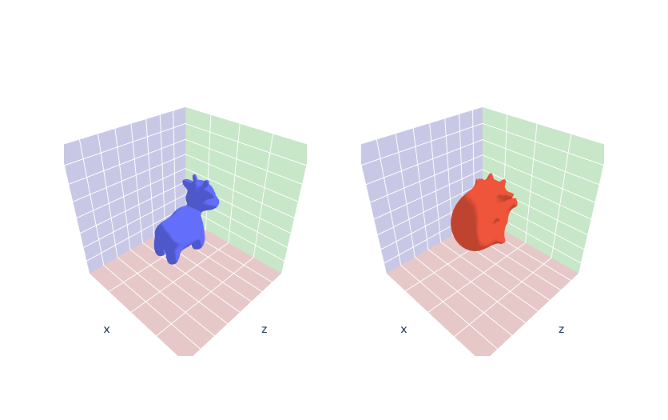
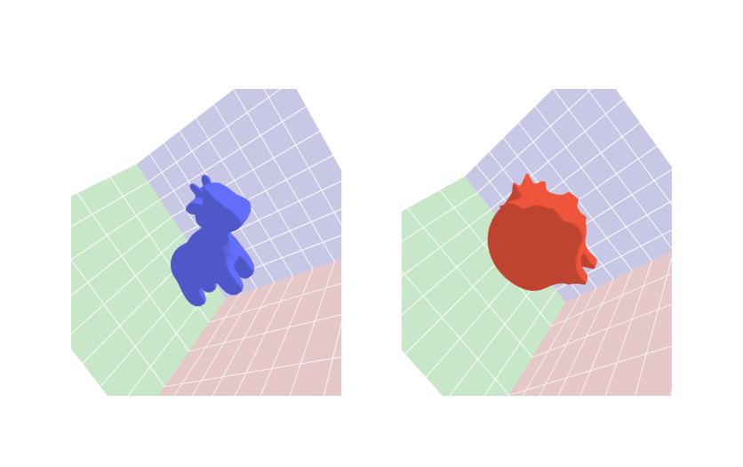
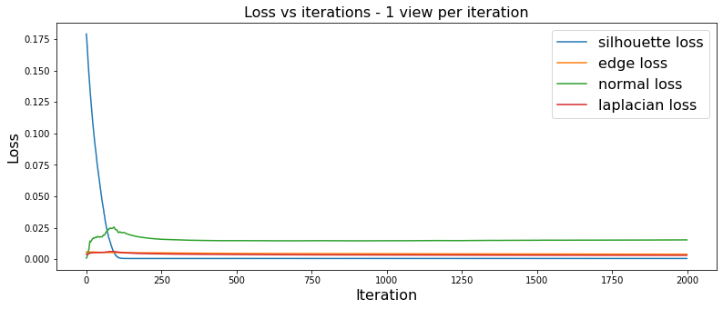
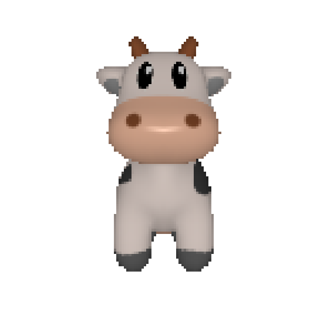
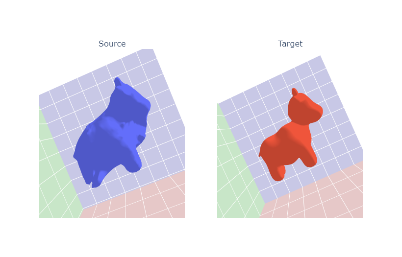
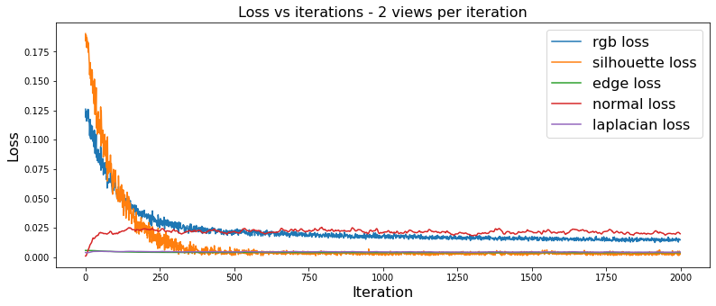
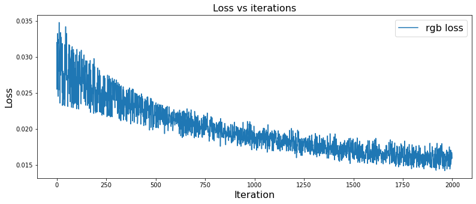
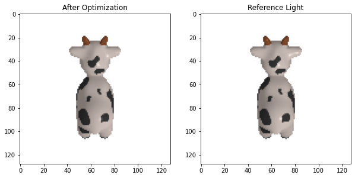

# 3D Graphics Systems Course - IMPA 2021

#### Leonardo Quatrin Campagnolo

---------

## Assignment 9 - View Optimization / Fit Mesh

In this assignment, the idea is to practice operations with differentiable rendering using the PyTorch3D to optimize meshes and scene parameters from multiple viewpoints. The code of this assignment can be found [here](https://github.com/lquatrin/i3d21_p/tree/main/code/a9/Assignment9.ipynb).

### Rendering pipeline and discontinuity issues

A rendering pipeline is used to generate 2d images from 3d scenes, where the scene is defined by 3d objects represented by vertices, lines and polygons. It projects the current scene onto the image plane defined by a camera in a 3D environment. To do that, the camera first transforms each 3D object from world to view coordinates, which can be seem as a change of basis, considering the camera positioned at (0,0,0) and directed along the z direction (being positive or negative depending on the convention). Then, a projection matrix (also given by the camera) projects the triangles onto the image plane, which is considered the xy-plane. A camera also defines which objects will be shown, and which objects will be discarded, when they do not influence the rendered image. In the last step, each pixel is colored by considering the nearest face. Texture mapping and lighting effects are also computed in this stage for each pixel.

According to [1], there are two steps that are not differentiable in rendering. First, the z discontinuity, which happens when two triangles are close in terms of depth, then a small change in its vertices may cause them to overlap. The overlap causes a discontinuity since it causes a step change in pixel color when the nearest face changes. There is also a second discontinuty problem caused by changing the position of a triangle in screen space. In this case, a step change in pixel color is caused due to face boundaries.

In PyTorch3D, they used a soft rasterizer [2] to solve these problems. The problem of z discontinuity is solved by soft aggregating the K nearest faces. The second discontinuity problem was solved by decaying each face’s influence toward its boundary. It is important to notice that PyTorch3D is implemented based on each face that intersects the camera's image plane, instead of considering each pixel, since the face blending have to be calculated.

### Dataset Creation

In this assignment, the cow mesh was used. So, first,  different camera positions are sampled, encoding multiple viewpoints of the cow:


Using the silhouette renderer, it shows the top k faces per pixel, based on the 2d euclidean distance of the center of the pixel to the mesh face:


Using these shader, it is possible to compare the edges of the mesh according to each viewpoint. In these cases, the lighting is not computed, according to the documentation [3]. Here, i made a simple test by changing the light source position and generate the images with silhouette renderer:


Both configurations generated the same images when using **SoftSilhouetteShader**.

### Mesh prediction via silhouette rendering

In this first experiment, a mesh will be predicted by observing target images without any knowledge of the ground truth. Here, cameras and lighting positions are assumed to be known. The optimized mesh is initialized as a sphere, and an offset will be learned for each vertex at each optimization step. Here, i have the first ground truth images generated using multiple viewpoints of the cow mesh with silhouette renderer, that will be used to fit the sphere to the target mesh:


The offsets were initialized on zero, and each iteration computes the loss from 2 randomly chosen views. The loss function evaluates the silhouette of the generated images with the target images. Besides that, edge loss (**mesh_edge_loss**), mesh normal consistency (**mesh_normal_consistency**), and mesh laplacian smoothing (**mesh_laplacian_smoothing**) were also added to the loss function. I start by using the following weights:

```python
losses = { "silhouette": { "weight": 1.0,  "values": []},
           "edge":       { "weight": 1.0,  "values": []},
           "normal":     { "weight": 0.01, "values": []},
           "laplacian":  { "weight": 1.0,  "values": []}, }
```

After 2000 iterations, i got the following result:


As we can see, the resultant mesh is smoother compared to the target, but it is also a similar result. I then made some additional testes by using different number of views per each iteration:

1. **1 view per iteration**


2. **4 views per iteration**




3. **8 views per iteration**


With only 1 view per iteration, the result does not converge properly as using 2 views. However, from 4 to 8 views, i didn't get an effective change between the results.

Since we're comparing images to approximate the mesh, it is important to have a good representations of the object, defined by multiple views. Using only one image, it is not possible to approximate the mesh correctly (using this optimzation procedure). Here, i made an additional test with only one point of view:





wit the reference image being:



As we can see, using only one point of view, it is not possible to optimize the mesh properly.

#### Using ico_sphere with higher detail level  

For the first experiments, i used a sphere generated from **ico_sphere** [4] using level = 4. Comparing the number of vertices of each mesh, the sphere with level = 4 has a similar number of vertices comparing with the cow mesh. In a last experiment, i made a test if it is possible to generate better results using a sphere with level = 5:

```python
Cow Mesh Vertices: 2930
Sphere level 4 Mesh Vertices: 2562
Sphere level 5 Mesh Vertices: 10242
```

After the optimization loop, i saw the cow's neck was not well defined:



Trying to make a better investigation about why it happened, i change the current set of reference views used to optimize the mesh, trying to put more focus at the cow's neck:


After running the optimization procedure again, it is possible to check how this specific part of the mesh is closer to the target. However, other parts of the mesh became less similar compared to the target. In this way, we can see that good representative images are important to generate a good approximation of the mesh when using differentiable rendering.


### Mesh and texture prediction via textured rendering

Now, the idea is to optimize both mesh vertices and texture. In this case, the additional loss is added to compare the RGB of the image. The optimization procedure again starts with a sphere now with a grey color defined at each vertex to be optimized. In this case, **SoftPhongShader** is used instead of **SoftSilhouetteShader**, to be able to compare RGB images. After 2000 iterations, i got the following result:




We can see that the texture is converging, but still far in terms of detail and high color variations. One thing that i notice is the rgb loss was still slowly decreasing near the 2000 iterations, and the other losses converge to a value with fewer iterations. Trying to achieve a better result, i first tried to halve the other losses, ending up with the following loss weights:

```python
losses = { "rgb":        {"weight": 1.0,   "values": []},
           "silhouette": {"weight": 0.5,   "values": []},
           "edge":       {"weight": 0.5,   "values": []},
           "normal":     {"weight": 0.005, "values": []},
           "laplacian":  {"weight": 0.5,   "values": []}, }
```

After 2000 iterations, i got the following result:


It is important to notice that both vertex positions and textures are being optimized together only with image observations. So, the texture color will be optimized according its position in relation to the image, which might be wrong during the mesh optimization. So, in a second result, i tried to optimize only the texture, by making a copy of the target mesh. In this case, i got the following result:




which is still far from the original mesh, but it seemed better compared with the other experiment with mesh prediction.

One of the things that also must be considered, is that we're trying to compute the color of each vertex for a mesh, when the target mesh actually uses a UV mapping, where the color is calculated per each pixel based on the uv coordinates of each vertex. In a last experiment, i tried to deform the target mesh to a sphere, and then back to the original mesh using multi-view images. I got the following result after these two operations:


It shows how the vertices didn't go back to the original position after doing these two operations.

### Camera Position Optimization

Until now, the cameras used to generate the images are known and we try to learn the geometry and texture of the mesh. Now, the objective is to use differentiable renderer to infer the camera position, knowing the geometry and texture of the object. I tested the optimization procedure with some different elevation and azimuth angles. For each test, i calculate the difference between the two cameras by composing the cosine of the relative angle between the rotation components with the L2 ditance between translation vectors (from [Bundle Adjustment Assignment](https://github.com/lquatrin/i3d21/blob/main/assignment_3.md)):

```python
def calc_camera_distance(R1, R2, T1, T2):
    # rotation distance
    R_distance = (1.-so3_relative_angle(R1, R2, cos_angle=True)).mean()
    
    # translation distance
    T_distance = ((T1 - T2)**2).sum(1).mean()
    
    # the final distance is the sum
    return R_distance + T_distance
```

For each experiment, i generate the gif with images generated during the optimization, and the final result for visual comparison:

1. elevation = 50.0 | azimuth = 0.0 | Final distance = 0.0083


2. elevation = 0.0 | azimuth = 90.0 | Final distance = 0.0083


3. elevation = 0.0 | azimuth = -90.0 | Final distance = 1.8392


4. elevation = 0.0 | azimuth = 180.0 | Final distance = 2.0303


5. elevation = 0.0 | azimuth = 45.0 | Final distance = 0.0080


The 3th and 4th experiments didn't converge to the correct position. It seems that the optimization procedure gets stuck in a position where it can't find a better direction to converge based on the generated images.

### Light Position Optimization

The last experiment of this assignment was to optimize a light position knowing the camera parameters. In this case, i made a small modification to the model class and changed the parameter to be the light position:

```python
 class ModelE2(nn.Module):
    def __init__(self, meshes, mesh_renderer, image_ref, camera):
        super().__init__()
        self.meshes = meshes
        self.device = meshes.device
        self.renderer = mesh_renderer
        self.camera = camera
        
        # Get the rgb image
        image_ref = torch.from_numpy(image_ref[..., :3])
        self.register_buffer('image_ref', image_ref)
        
        # Create an optimizable parameter for the x, y, z position of the light.        
        self.light_position = nn.Parameter(
            torch.from_numpy(np.array([0.0,  0.0, 0.0], dtype=np.float32)).to(meshes.device))

    def forward(self):
        # Render the image using the updated light position.
        cam_lights = PointLights(device=self.device, location=self.light_position[None, :])
        image = self.renderer(meshes_world=self.meshes.clone(), cameras=self.camera, lights=cam_lights)
        
        loss = torch.sum((image[..., :3] - self.image_ref) ** 2)
        return loss, image
```

In this case, i started the light position at [0.0, 0.0, 0.0], and the target light position is at [1.0, 1.0, 2.0]. After 2000 iterations, i got the following result:

1. Final optimized light position: [1.933383  1.3485548 2.8575547]



with distance between the optimized light and the target being 1.3145700074906765. It is possible to see how some specular effects are a little different from the reference image, but still similar to the target.

### References

[1] Accelerating 3D Deep Learning with PyTorch3D

[2] Soft Rasterizer: Differentiable Rendering for Unsupervised Single-View Mesh Reconstruction

[3] Shader - PyTorch3D 0.2.0 documentation. Available at: https://pytorch3d.readthedocs.io/en/latest/modules/renderer/shader.html

[4] pytorch3d.utils.ico_sphere - PyTorch3D 0.2.0 documentation. Available at:  https://pytorch3d.readthedocs.io/en/latest/_modules/pytorch3d/utils/ico_sphere.html
